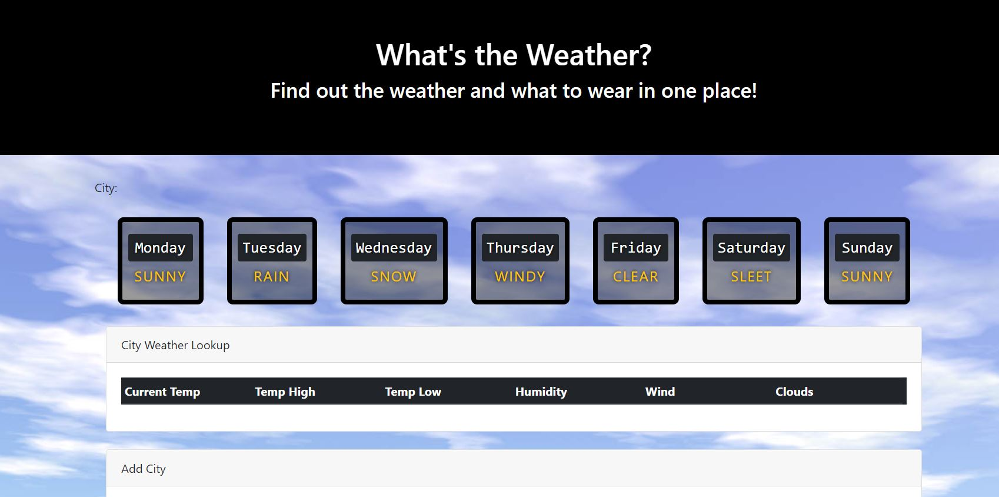

# PROJECT TITLE: Weather Dashboard

## Team

This is the team for project 1.  Team Members are:

* Kelsie Daniels
* Justin Thomas
* Michael Wilson
* Paul Linck

## Project Description:

This is a location/weather application.  You will be able populate weather information and top restaurants in any given city.  You will also be able add buttons for your favorite cities to search

## Sketch of Final Project

## APIs Used:
Open Weather API
Google Maps Platform API
Places API

## Breakdown of Tasks:
Person1: Build the wireframe for both pages of our app.  This includes creating the html and styling

Person2: Research, then setup weather API.  Pull and place relevant data from API into each page

Person 3: Research, then setup Places API.  Pull and place relevant data from API into each page

Person 4: Setup firebase database to dynamically store data

## MVP

1. Target Audeience - _Travelers_.  We are targetting the travels to help them plan their trip and heklp them with ideas when they actually get there.  For example plan for what to pack based on weather and where to eat when they get there.

2. Problem addressed.  Consolaiated dashboard for giving you all the things you may need to go to multiple places to get.  This allows the user to go to one place for the things they frequently need when going on a trip.

3. Primary Goal.  Location Dashboard and store favorite travel places.

4. Essential User Stories
   * Create Dashboard HTML Wireframe
     [ ] Figure out how many days of weather to display
     [] Create Header or Jumbotron
     * Create input design for selecting one of saved favorties
     * Create link to switch to page to create a new favorite
     * Mock up what weather data will look like
     * Mocke up what places data will lok like on the page
   * Generate google places API for address, city or zip code
   * Decide whether we want a location map
   * Issue - how should we deal with API Keys - sharing but secure?

=======
