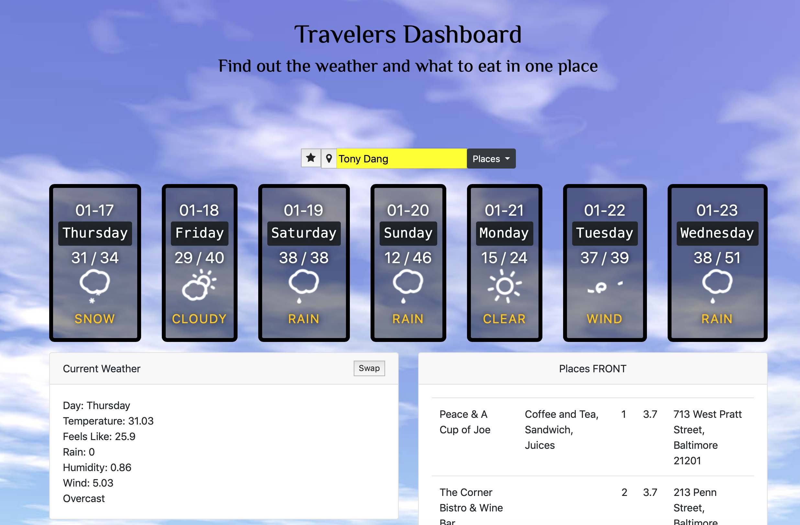
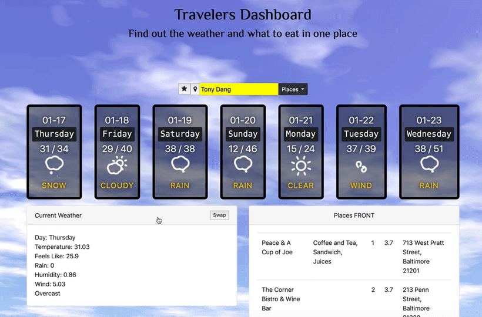
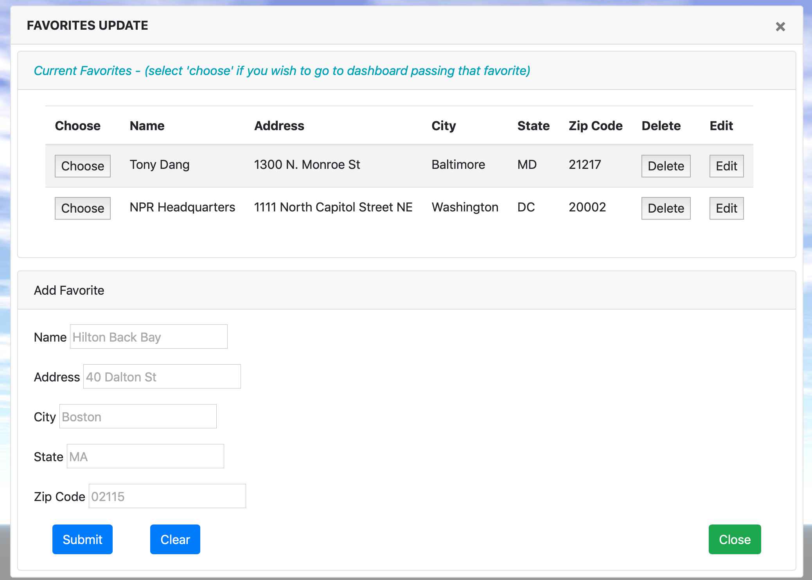
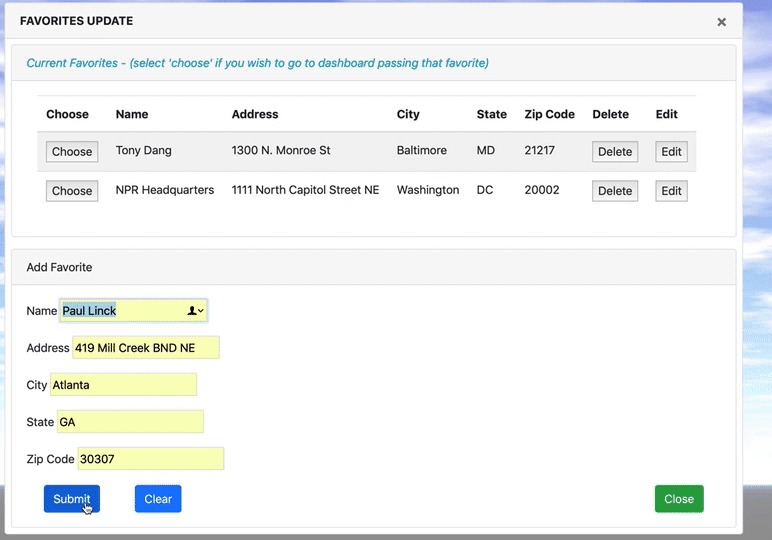
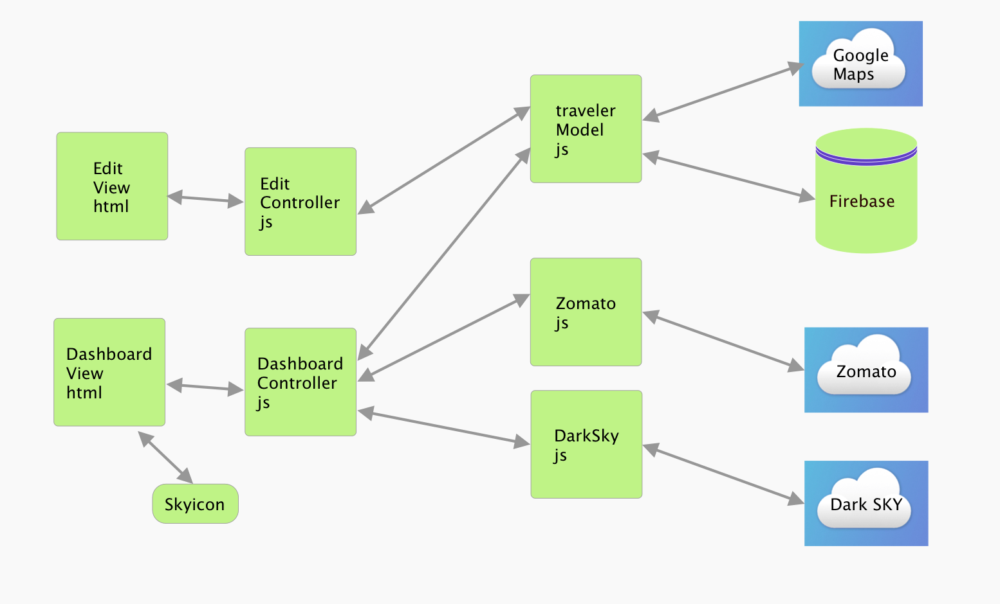

# PROJECT TITLE: Travelers Dashboard

## Team

This is the team for Project 1.  Team Members are:

* Kelsie Daniels - Weather API
* Justin Thomas - Zomato Places
* Michael Wilson - UX/UI and geolcation
* Paul Linck - firebase, and google address validation

## Project Description

This is a Traveler Dashboard application.  You will be able populate weather information and top restaurants in any given place (city, address, POI etc).  You will also be able add and store  your favorite places to search.

## Sketch of Final Project

## APIs Used

* Dark Weather API
* Zomato API for places
* Firebase for data storage of favorite places
* Google Maps for geolocation and address validation

## Architecture Overview

## Breakdown of Tasks

Mike: Build the HTML/CSS and tag JS hooks for the traveler dashboard.  Research data from APIs to design proper look and feel.  

Kelsie: Research, then setup weather API.  Pull and place relevant data from API into dashboard

Justin: Research, then setup Places API.  Pull and place relevant data from API into dashboard

Paul: Setup firebase database to dynamically store data and build CRUD pages for maintaining them

## MVP

1. Target Audeience - _Travelers_.  We are targetting the travelers to help them plan their trip and help them with ideas when they actually get there.  For example plan for what to pack based on weather and where to eat when they get there.

2. Problem addressed.  Travels needing to go to multiple websites to get the information they want to research their travel destination. Our app resolves this with a consolidated dashboard for giving you all the things you may need to go to multiple places to get.  This allows the user to go to one place for the things they frequently need when going on a trip.

3. Primary Goal.  Location Dashboard with weather and places with ability to store favorite travel destinations for quick lookup.

4. Essential User Stories (see projet dashboards)
   * Create Dashboard HTML Wireframe
   * Create API for places
   * Create API for weather
   * Create Model for firebase storing favorites

=======
